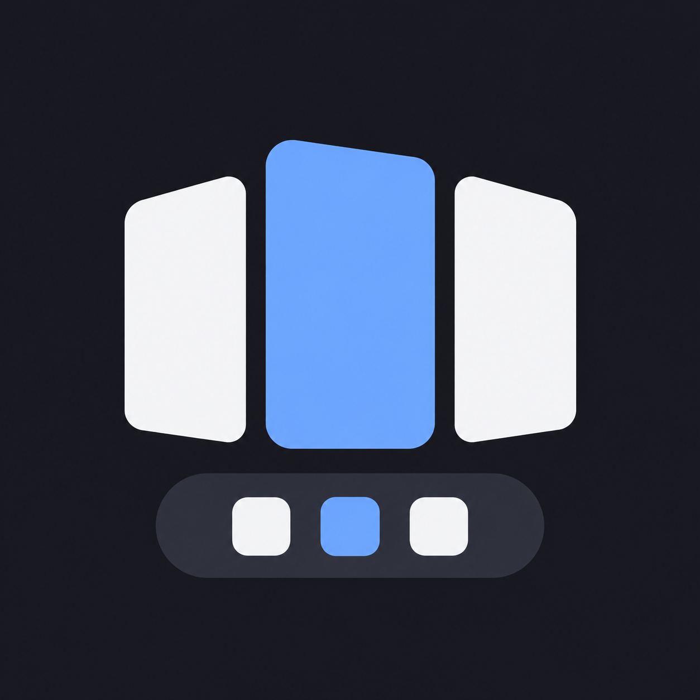
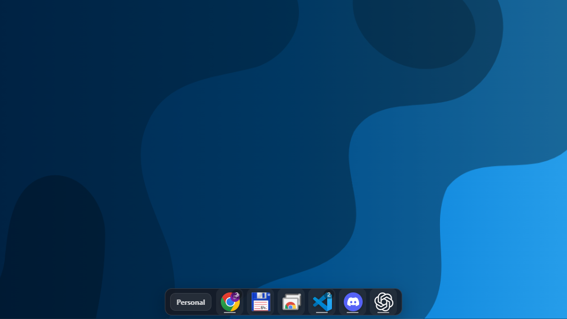
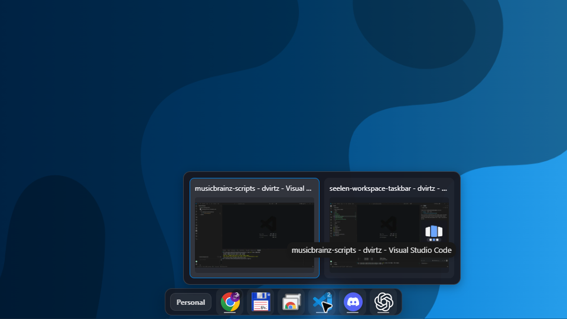
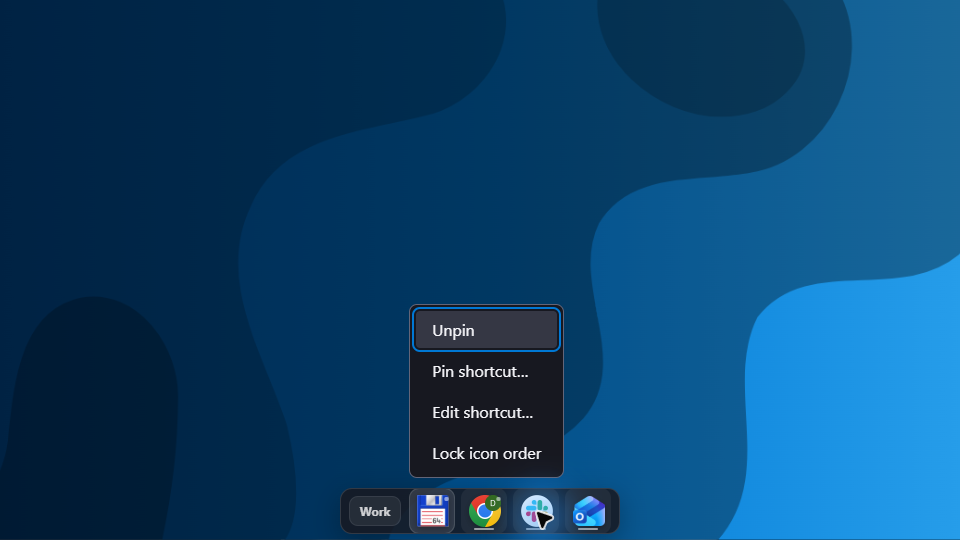

# Seelen Workspace Taskbar



A Seelen UI widget with taskbar state scoped to the active Seelen workspace.

## Screenshots

The Personal workspace taskbar shows its pinned apps and running-window counts.



Grouped window previews let you choose which app window to open.



The Work workspace has its own apps, with a right-click menu for managing shortcuts and icon order.



## What it does

- Creates one bottom taskbar per monitor.
- Shows only windows belonging to that monitor's active Seelen workspace.
- Includes windows pinned globally by Seelen.
- Stores app pins independently for each monitor and workspace.
- Drag icons left or right to reorder pinned shortcuts and running apps. Order is saved per monitor and workspace, including across restarts. Drop outside the icon row or press Escape to cancel.
- Right-click an icon and choose **Lock icon order** to prevent reordering; choose **Unlock icon order** to enable it again. The lock is saved per monitor and workspace.
- Shows application icons with app names on hover.
- Hover an app with multiple windows to see thumbnails and titles, then click a preview to focus that window. Focus an app icon and press Up to select previews with the keyboard; Escape dismisses them. Windows without a thumbnail remain selectable by title.
- Supports Never, Always, and On overlap auto-hide modes, configurable per monitor.
- Supports Minimal and Full Width modes, configurable per monitor.
- Uses a layered hitbox, so hidden and transparent areas do not block windows underneath.
- Hides the native Windows taskbar while enabled and restores the previous SeelenWeg state when disabled.
- Left-clicks focus/minimize a running app or launch a pinned app.
- Right-click an icon and choose **Pin application** (or **Unpin** for existing pins), or **Pin shortcut…** to open the shortcut form prefilled with the app's name, launch path, available arguments, and working directory.
- The shortcut form accepts a name, an application or Windows shortcut (`.lnk`) path, optional arguments, and an optional working directory. Enter arguments separately from the path; quote argument values containing spaces (for example, `--profile "Work profile"`).
- Shortcut pins launch their saved command and group matching running windows under the shortcut icon. Clicking a running shortcut focuses or minimizes its window. Multiple shortcuts can use different arguments; newly opened windows are associated with the matching shortcut most recently launched. If several shortcuts match an existing window and its launch details cannot distinguish them, it appears separately. Right-click a shortcut and choose **Unpin** to remove it.
- Right-click a pinned shortcut and choose **Edit shortcut…** to change its saved details. **Save changes** updates the existing pin in place; **Cancel** leaves it unchanged.

If an icon has not been cached yet, the widget asks Seelen to extract it and temporarily shows a letter tile. The taskbar is an overlay and does not reserve screen space.

## Build

The authored widget code is TypeScript in `src/index.ts`. Builds are strictly type-checked, then bundled to loadable JavaScript in `dist/widget/index.js`.

```powershell
npm install
npm run build
```

## Load for development

Keep Seelen UI running, then run:

```powershell
npm run load
```

In Seelen Settings, enable **Workspace Taskbar**. The widget uses SeelenWeg's service-managed native-taskbar ownership while suppressing SeelenWeg's visual instances. Loaded development resources are session-only and must be loaded again after restarting Seelen UI.

To unload it:

```powershell
npm run unload
```

To rebuild the widget and create a distributable YAML file under `dist/bundles/`:

```powershell
npm run bundle
```

Loading, unloading, and bundling require the Seelen CLI. Set `SLU_PATH` to override its executable path
(the default on Windows is `C:\Program Files\Seelen\Seelen UI\slu.exe`).

## Releases

CI type-checks and bundles the widget on pull requests and pushes to `main` or `beta`.
It then runs semantic-release, which skips publishing on pull requests and
publishes stable releases on `main` and prereleases such as `1.0.0-beta.1` on `beta`.
It creates a version tag and GitHub release with generated release notes and a
`workspace-taskbar-<version>.yml` download. The release workflow extracts the
Seelen CLI from its official Windows package and authenticates with a GitHub App.
Configure the `SEMANTIC_RELEASE_APP_ID` repository variable and
`SEMANTIC_RELEASE_PRIVATE_KEY` secret. The app needs repository contents, issues,
and pull requests write permissions, plus permission to push release commits to
`main` and `beta` under any branch protection rules. Releases are GitHub-only.

Use [Conventional Commits](https://www.conventionalcommits.org) for release changes.
Releases synchronize the version in `package.json` and `package-lock.json` using
`semantic-release-mirror-version` and commit both files with `@semantic-release/git`.
The CI workflow can also be run manually on `main` or `beta` to retry a failed release.

## License

Copyright (C) 2026 dvirtz.

This project is licensed under the [GNU Affero General Public License v3.0 only](LICENSE).
It uses [`@seelen-ui/lib`](https://www.npmjs.com/package/@seelen-ui/lib), which is also distributed under the GNU Affero General Public License v3.0. See [THIRD_PARTY_NOTICES.md](THIRD_PARTY_NOTICES.md) for attribution.
